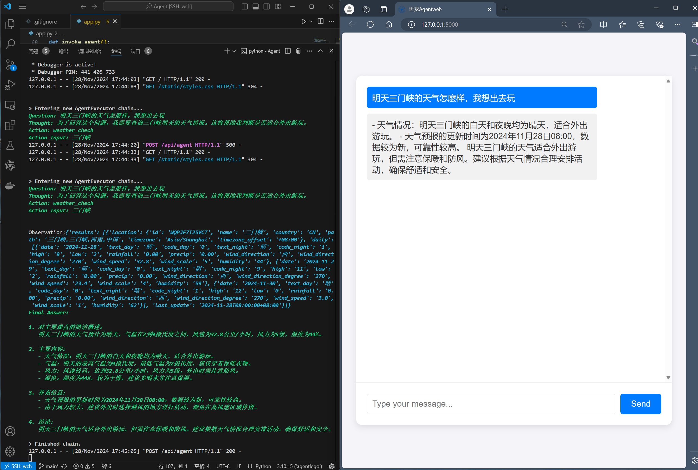

项目demo:

### Agent类
|  Agent类型      |  功能       
|-----------------|------------|
| React_Agent     | 调用工具    |
| reflect_Agent   | 自我反思    |
| multi_Agent     | 代理协作    |

### Tools
| 工具名称          | 功能                               |
|------------------|----------------------------------------|
| 天气查询          | weather - 提供天气查询功能            |
| 鱼体追踪          | track - 实现鱼体追踪功能               |
| openmm系列工具    | 计算器、AIGC类、检测类等               |
| 功能持续开发中…   | 持续开发更多工具和功能                 |

### crossref_api + sci_spider 
| step          | 功能描述                               |
|------------------|----------------------------------------|
| crossref_api          | 爬取doi            |
|sci_spider|下载pdf|

### other tools
| 工具          | 功能                               |
|------------------|----------------------------------------|
| 大模型下载          |download_llm.py            |
|大模型测试|test_llm.py|
|前端|app.py|

